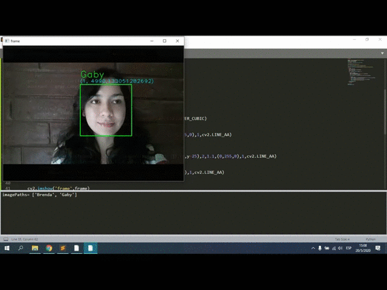
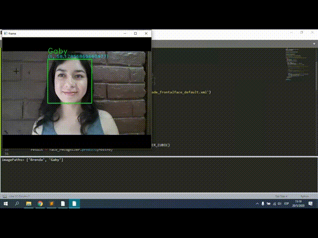

## 👩 Reconocimiento Facial 👨 | Python - OpenCV

Para una descripción más detallada sobre el proceso de construcción de los programas, por favor dirígete a:

Mi blog: https://omes-va.com/reconocimiento-facial-python-opencv/

Video: https://youtu.be/cZkpaL36fW4

En capturandoRostros.py vamos a capturar las personas que deseamos reconocer. En entrenandoRF.py entrenamos el reconocedor de rostros con:
EigenFaces, FisherFaces y LBPH. Finalmente podremos probar cada uno de los métodos (por separado) en ReconocimientoFacial.py

#EigenFaces

#FisherFaces

#LBPH

